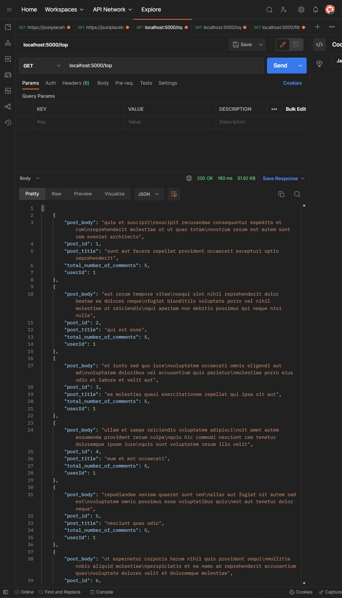
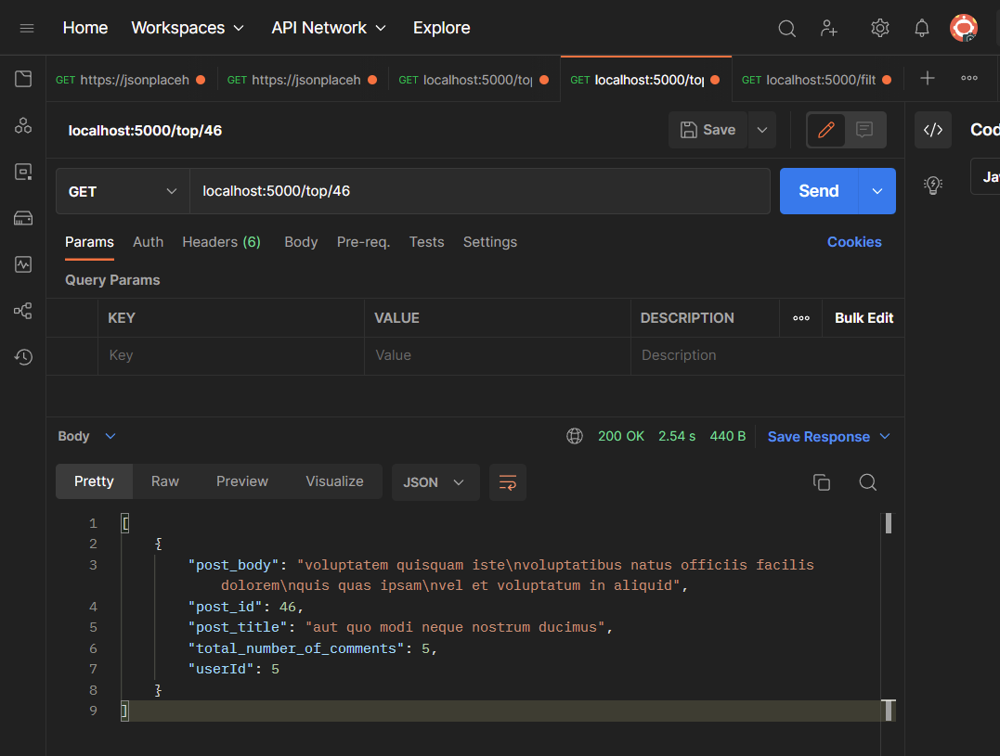
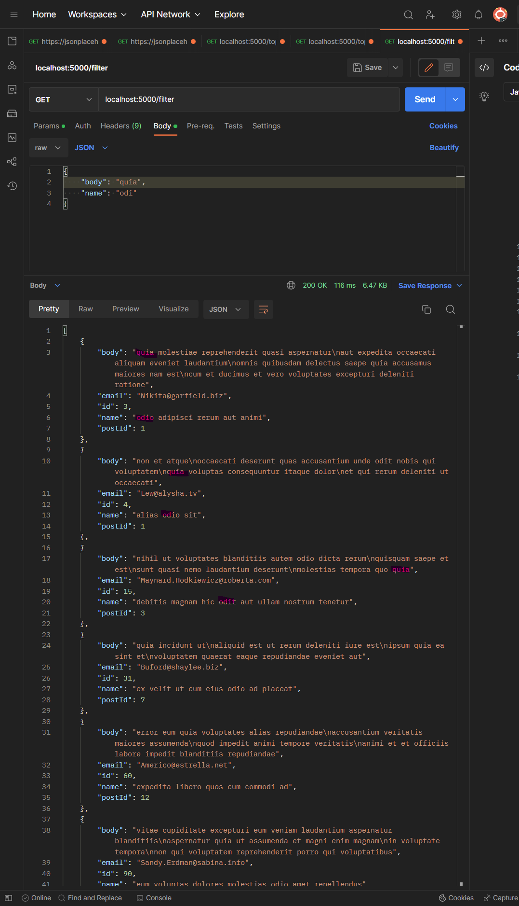

# tribehired_flask

API for listing posts and related comments

### API exposed:
- `<domain>/top` - GET
  - list all top posts ordered by number of comments
- `<domain>/top/<post_id>` - GET
  - show the post based on given post ID
- `<domain>/filter` - GET `payload`
  - query or filter the comments based on given constraint
  - filters allowed:
    - post ID: exact matching of post ID
    - id: exact matching of comment ID
    - name: partial matching of name, non-case-sensitive
    - email: partial matching of email, non-case-sensitive
    - body: partial matching of body, non-case-sensitive

### Sample output

#### Sample output of question 1

#### Sample output of question 1, with post ID 46

#### Sample output of question 2, with filtering by:
- body text that containts the word 'quia'
- name that containts the word 'odi'
